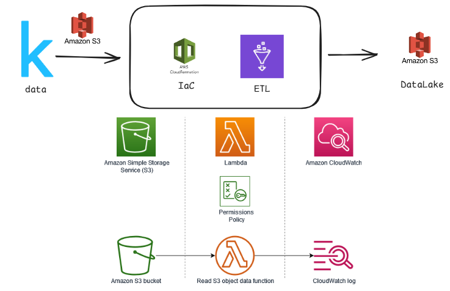
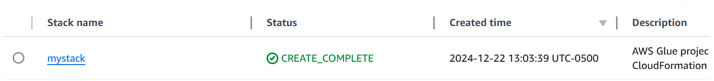
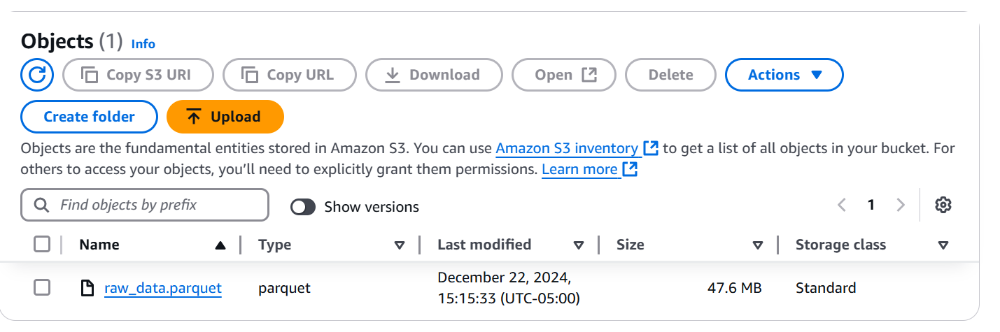
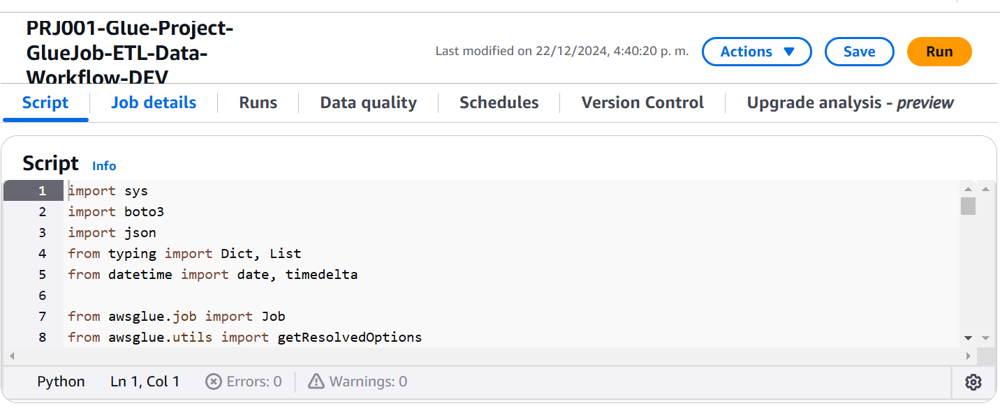
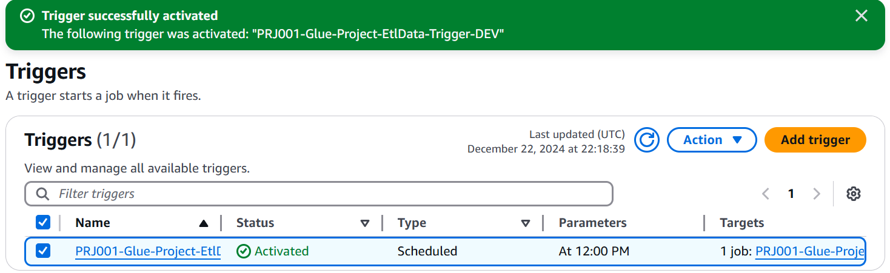
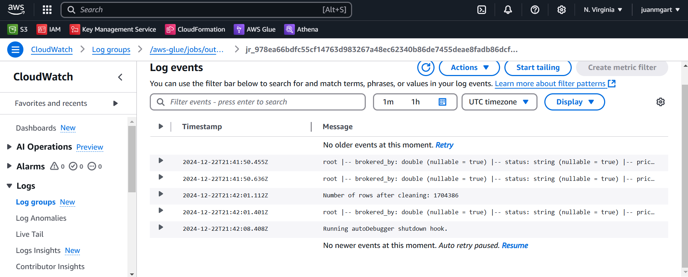
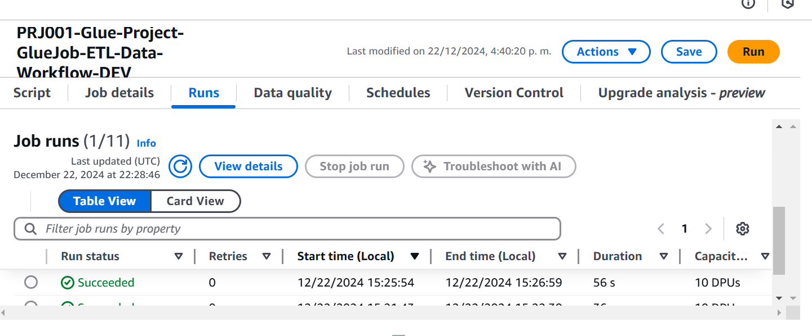

# Proyecto de Flujo de Datos de Bienes Raíces
## Fuente de los Datos
Los datos utilizados en este proyecto provienen de [Kaggle](https://www.kaggle.com/datasets/0e23f01c0fc5a3d7a83e20023c70534df3cbbc6c23f1baf19f2ae3961a1576d7).

## Objetivo
El objetivo de este proyecto es procesar y analizar datos de bienes raíces para generar un conjunto de datos final (`final_real_estate_insumo`) con columnas adicionales calculadas. Este conjunto de datos se utilizará para análisis y obtención de información.

## Preguntas a Abordar
- ¿Edad de la casa en años?
- ¿Cúal es el precio por pie cuadrado?
- ¿Cúal es el número total de habitaciones?
- ¿Cúal es el precio por habitación?
- ¿Cúal es el precio de la propiedad por tamaño del terreno?

## Elección del Modelo
El modelo elegido para este proyecto implica el uso de AWS Glue para operaciones ETL (Extracción, Transformación y Carga) y Apache Spark para el procesamiento de datos. Esta elección se hizo debido a la escalabilidad y flexibilidad de estas herramientas para manejar grandes conjuntos de datos y transformaciones complejas.

## Enfoque para Diferentes Escenarios

### Si los Datos se Incrementan en 100x
- **Escalabilidad**: Aprovechar la escalabilidad de AWS Glue y Spark aumentando el número de nodos de trabajo y utilizando particionamiento para manejar conjuntos de datos más grandes de manera eficiente.
- **Almacenamiento**: Utilizar Amazon S3 para almacenamiento escalable y considerar el uso de formatos de almacenamiento columnar como Parquet para consultas eficientes.

### Si las Tuberías se Ejecutan Diariamente en una Ventana de Tiempo Específica
- **Programación**: Utilizar AWS Glue Workflows y AWS Step Functions para programar y gestionar los trabajos ETL para que se ejecuten dentro de la ventana de tiempo especificada.
- **Procesamiento Incremental**: Implementar procesamiento de datos incremental para manejar actualizaciones diarias de datos de manera eficiente.

### Si la Base de Datos Necesita Ser Accedida por Más de 100 Usuarios Funcionales
- **Concurrencia**: Utilizar Amazon Redshift o Amazon Aurora para manejar alta concurrencia y proporcionar un rendimiento rápido en las consultas.
- **Caché**: Implementar mecanismos de caché utilizando Amazon ElastiCache para reducir la carga en la base de datos.

### Si se Requiere Hacer Analítica en Tiempo Real
- **Procesamiento en Tiempo Real**: Utilizar AWS Kinesis o Apache Kafka para la ingesta y procesamiento de datos en tiempo real.
- **Analítica de Streaming**: Implementar analítica de streaming utilizando Apache Spark Streaming o AWS Kinesis Data Analytics.

## Parámetros del Workflow
Las siguientes son las propiedades de ejecución predeterminadas para el workflow:

| Clave                  | Valor                                      |
|------------------------|--------------------------------------------|
| S3_BUCKET              | data-engineer-juanmgart                    |
| PATH_RAW_DATA          | rawData/housing_data/raw_data.parquet      |
| TABLE_NAME             | final_real_estate_insumo                   |
| DATABASE_NAME          | trusted_data                               |
| OUTPUT_TABLE_PATH_S3   | output_files              |
| GLUE_CATALOG           | AwsDataCatalog                             |

## Estructura del Proyecto
El script principal del proyecto es `DataWkflow-Job.py`, que incluye las siguientes funciones:
- `read_parquet_s3(bucket: str, key: str) -> DataFrame`: Lee un archivo Parquet desde S3.
- `data_cleaning(df: DataFrame) -> DataFrame`: Limpia los datos eliminando valores nulos y duplicados.
- `calculate_final_df(df: DataFrame) -> DataFrame`: Calcula columnas adicionales para el conjunto de datos final.
- `save_to_s3(df: DataFrame, bucket: str, key: str) -> None`: Guarda el conjunto de datos final en S3.

## 🌟 Flujo General de Trabajo
El flujo de trabajo incluye las siguientes ramas y ambientes:

| **Ambiente**  | **Rama**     | **Propósito**                                              |
|---------------|--------------|------------------------------------------------------------|
| 🌱 **Develop**  | `develop`    | Desarrollo y pruebas iniciales.                           |
| 🚀 **Release**  | `release`    | Validación previa al despliegue en producción.            |
| 🏆 **Producción**| `main`       | Código estable y aprobado en producción.                  |

## 📂 Organización del Repositorio
📦 data-workflow-project
├── 📂 aws-Resrcs
│   ├── 📂 azure-pipelines.yml
│   ├── 📂 infraCloudformation-params.json
│   ├── 📂 infraCloudformation.yaml
├── 📂 glue-job
│   ├── 📂 DataWkflow-Job.py
└── README.md

## Explicación de la Organización del Proyecto
He organizado el proyecto de esta manera para mantener una estructura clara y modular que facilite el desarrollo y mantenimiento del mismo:

- **aws-Resrcs**: Esta carpeta contiene los archivos relacionados con la infraestructura en la nube, como los parámetros y plantillas de CloudFormation, y el archivo de configuración de Azure Pipelines. Esto permite gestionar y desplegar la infraestructura de manera automatizada y reproducible.
- **glue-job**: Esta carpeta contiene el script principal del trabajo de AWS Glue (`DataWkflow-Job.py`). Al separar el código del trabajo de Glue en su propia carpeta, se facilita la gestión y el desarrollo del código ETL.
- **README.md**: El archivo README proporciona una descripción general del proyecto, incluyendo el objetivo, las preguntas a abordar, la elección del modelo, los enfoques para diferentes escenarios, los parámetros del workflow y la estructura del proyecto. También incluye una imagen de la arquitectura y la fuente de los datos.

Esta organización permite una clara separación de responsabilidades y facilita la colaboración y el mantenimiento del proyecto.

## Paso a paso creación proyecto en AWS

1. **Crear el Stack en CloudFormation**
   - Sube el archivo `infraCloudformation.yaml` a AWS CloudFormation para crear el stack.
   - Esto configurará la infraestructura necesaria para el proyecto, incluyendo roles IAM, buckets S3 y otros recursos necesarios.
   

2. **Añadir el Dataset al Data Lake (S3)**
   - Sube el dataset al Data Lake en Amazon S3 en formato Parquet para un mejor procesamiento.
   - El formato Parquet es eficiente en términos de almacenamiento y rendimiento de consulta.
   

4. **Crear y Configurar el Job en AWS Glue**
   - En la consola de AWS Glue, navega a la sección de Jobs y crea un nuevo Job.
   - Asigna un nombre al Job, por ejemplo, `PRJ001-Glue-Project-GlueJob-ETL-Data-Workflow-DEV`.
   - Selecciona el rol IAM creado por el stack de CloudFormation.
   - Configura el script del Job para que apunte al archivo `DataWkflow-Job.py` en tu bucket S3.
   - Configura las opciones de ejecución, como el tipo de instancia y el número de workers.
   

5. **Programar el Job en AWS Glue**
   - Crea un trigger en AWS Glue para programar la ejecución del Job.
   - Configura el trigger para que se ejecute diariamente a las 12:00 PM UTC.
   - Asocia el trigger con el Job `PRJ001-Glue-Project-GlueJob-ETL-Data-Workflow-DEV`.
   

6. **Ejecutar y Monitorear el Job**
   - Ejecuta el Job manualmente la primera vez para asegurarte de que todo esté configurado correctamente.
   - Monitorea la ejecución del Job en la consola de AWS Glue para verificar que se complete sin errores.
   - Revisa los logs generados en CloudWatch para obtener detalles sobre la ejecución del Job.
   
   